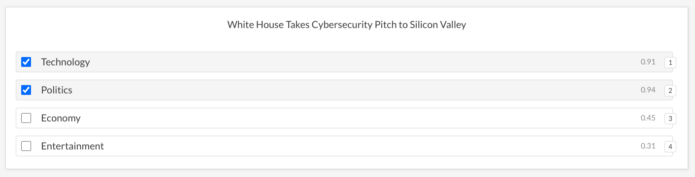
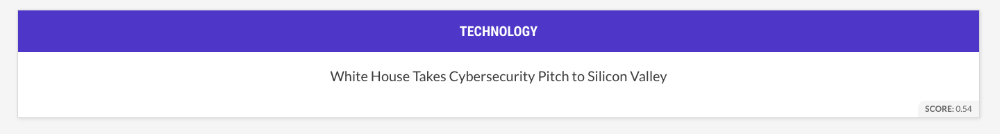
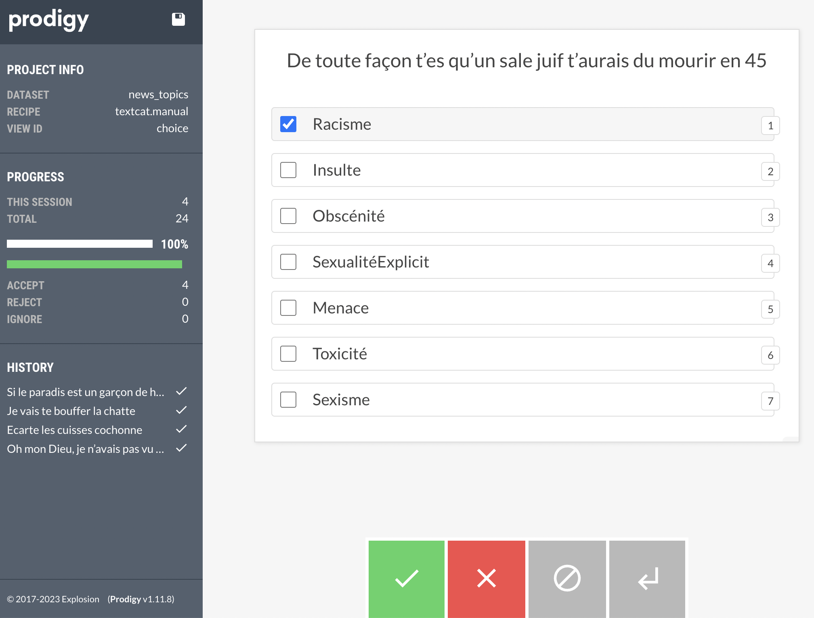

# 1. Potential Labels

Labels we have currently:

1. Racisme
2. Insulte (et Discrimination)
3. Obscénité
4. Sexualité explicite
5. Menace
6. Toxicité
7. Sexisme

**Suggestion:** We may merge some of them and group into 5:

1. Hate Speech: (Racisme + Sexisme)
2. Insult
3. Obscene / Sexual (Obscénité + Sexualité explicite)
4. Threats of Violence (Menace)
5. Cyberbullying / Toxic (Toxicité)

---

* We will also need to include `None` class for safe texts. 
 
* All of these can also be grouped and problem can be converted into the binary as (safe or not)

# 2. Task

We need to detect the labels we decide. There is 2 different approach to reaching this aim:

1- **Named-Entity-Recognition:** Select the text pieces where insult/bad words exist. This approach has the disadvantage of not detecting indirect meanings rather than exact words.

2- **Classification:** Understanding the general meaning of the text and trying to classify it rather than focusing on the single pieces.    
* 2.1. **Binary Classification:** Classifying between a single label (e.g. toxic or not)
* 2.2. **Multi-Class Classification:** Classifying between several labels at once. The model will select only one most suitable class (e.g. insult/hate speech/toxic/none)
* 2.3. **Multi-Label Classification:** Similar to multi-class but with this approach text might have multiple labels. For example, if a text contains both insult and hate speech the model will output both of these.

**We may follow the multi-label approach as single text may contain multiple of them at the same time.**

# 3. Labeling Strategy

First of all, we will need to collect a set of texts to annotate by humans. To collect this information we can scrape public comments on Youtube/Instagram/etc.

When we collect large amount of data it might not easy to annotate all as the number of toxic comments will be very low among them. To help us, we can use some public models to eliminate the ones with low probabiltiy of being toxiciticty. 
**Prodigy has a feature to use pre-trained model and guide the annotator. However it doesn't eliminate the data but it ask humans to correct the prediction**

For this process, we can use Hive, OpenAI, or any pre-trained language model to get a score of toxicity and eliminate ones with very lower scores to have more balanced data and reduce the effort required by the annotator.

# 4. Labeling Tool: 

## 4.1 Prodigy

Prodigy: https://prodi.gy/
Annotation tool for both named entity recognition and classification tasks. We can define our labels and list of sentences then annotate each of them using the Prodigy.
It also has a feature to guide annotator with a pre-trained model + updating model functionality with annotation feedbacks. It uses spacy models for that feature

### textcat.manual 
Just labeling without supervision.

### textcat.correct
labeling with suggestions from the model. It retrains models in batches of annotations to improve suggestions during annotation process.It also shows scores of each prediction on right of the selections.


### textcat.teach
Use a model similar to the textcat.correct method but this approach just suggest the label and ask if it is true or not rather than asking a selection of classes. It also shows score of prediction at the bottom.


### 4.1.2. Prodigy Experiment

I tried importing and annotating our own examples on Prodigy. It needs to have examples in `jsonl` format as one item per line in the following format:
```
{"text":"1st sentence","meta":{}}
{"text":"2nd sentence","meta":{}}
...
```
Running `manual` method (no labeling suggestion)
````
prodigy textcat.manual dataset_name dataset.jsonl --label Racisme,Insulte,Obscénité,SexualitéExplicit,Menace,Toxicité,Sexisme
````
To use `textcat.teach`, we need to have pre-trained model. Here we use Spacy's base french model `fr_core_news_md` with no classification capability at base. Prodigy will try to re-train it during our labeling session.

```
prodigy textcat.teach news_topics fr_core_news_md /Users/burakgozutok/Documents/Development/Nuage/safebear/dataset.jsonl --label Racisme,Insulte,Obscénité,SexualitéExplicite,Menace,Toxicité,Sexisme
```
Example screenshot from `textcat.correct`



**Binary Classification Example:**

Using only `Toxic` and `Normal` classes in `textcat.teach`:


### 4.1.3. Conclusion
* For both of the `textcat.correct` and `textcat.teach` methods, we will need to pre-train a model using some data otherwise they'll give random predictions for the beginning. It might not be a problem with `textcat.correct` but we won't be able to use `textcat.teach` like this. 

* We can improve this cold start issue using `--patterns ./patterns.jsonl` parameter. We can ask Prodigy to use our pattern words for deciding on the labels in the initial phase. This files content should have data in the following format:
```
{"label":"INSULT","pattern":[{"lower":"fuc***"}]}
{"label":"INSULT","pattern":[{"lower":"as***"}]}
```

* Both of the methods don't do any data elimination with the classification results but they just guide the annotator. So **we will still need to eliminate some the data at the beginning.** Otherwise Prodigy will ask all the examples to annotator without considering the model predictions. 


## 4.2. Labeling Tool Alternative: Doccano

Free, open-source alternative to prodigy for pure annotation without any model supervision (Similar to textcat.manual in prodigy). It has shortcuts to make labeling process easier and and we can update data and labels from web ui rather than using CLI commands.

